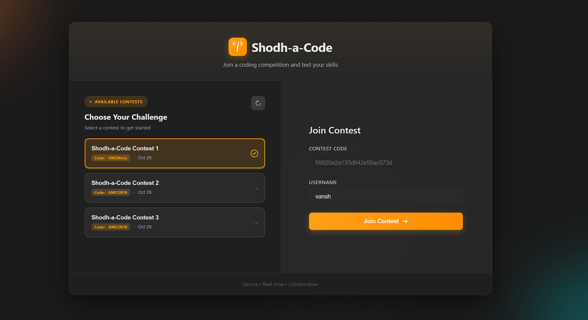

# Shodh-a-Code Contest Platform

A full-stack coding contest platform with multi-language execution in Docker, live leaderboards, and a clean contest UI.

## Features

- **Contest management**: Contests with problems, examples, and test cases
- **Multi-language judge**: Java, Python, C++ (g++), JavaScript (Node), Go
- **Container isolation**: Each test runs in a Docker container with CPU/memory limits
- **Read-only root FS**: Exec-enabled tmpfs for safe binary execution
- **Asynchronous submissions**: Background execution with status polling
- **Live leaderboard**: Aggregated per-contest standings
- **Editor UX**: Language templates, reset on problem change, and a styled confirm dialog when switching languages that would clear code

## Architecture

### Backend (Node.js + Express)
- REST API for contests, problems, and submissions
- MongoDB for persistence
- Docker-based code execution via a dedicated judge image (`shodh-judge`)
- Submissions run per-test-case with per-case status and timing

### Frontend (React)
- Problem view, code editor, and leaderboard
- Language selector (Python/C++) with in-app confirmation dialog on destructive switch
- Status polling for submissions and display of per-test results

### DevOps
- Docker Compose for orchestration (frontend, backend, mongo)
- Backend container needs access to the host Docker daemon (mounted docker.sock) to run the judge containers

## Quick Start

### Prerequisites
- Docker Desktop (Windows/Mac) or Docker Engine (Linux) with Docker Compose
- Git (optional)

### One-command startup

Windows (PowerShell):
   ```powershell
./build-and-run.bat
```

Linux/Mac:
   ```bash
   chmod +x build-and-run.sh
   ./build-and-run.sh
   ```
   
These scripts will:
- Build the judge image: `backend/judge/Dockerfile` → `shodh-judge`
- Start MongoDB, Backend, and Frontend via `docker-compose up --build -d`

### Manual startup

1) Build the judge image
   ```bash
   docker build -t shodh-judge -f backend/judge/Dockerfile backend/judge/
```
   
2) Start stack
```bash
   docker-compose up --build -d
   ```

3) Open the app
- Frontend: http://localhost:3000
- Backend API: http://localhost:5000
- MongoDB: localhost:27017

## Configuration

### Environment variables

Backend (set via compose; use a `.env` when running locally):
- `MONGODB_URI`: connection string for MongoDB
- `PORT`: default `5000`
- `NODE_ENV`: e.g., `production`
- `JWT_SECRET`: secret for auth tokens (set this yourself when not using compose defaults)

Frontend:
- API URL env is optional. The UI tries, in order: `apiUrl` prop → `NEXT_PUBLIC_API_URL` → `http://localhost:5000`.
- In compose we set `REACT_APP_API_URL` to `http://localhost:5000` which still works because the UI also accepts an explicit prop and has a fallback.

Judge runtime (internal):
- Backend runs judge containers with `--read-only` and a tmpfs mount for `/tmp` as `rw,exec,mode=1777,size=100m` so compiled artifacts (e.g., C++/Go) can execute.

### Data and seeding
- On first backend start, the database is auto-seeded with a sample contest and problems (see `backend/server.js`).

## Local development (without full Docker stack)

You can run the frontend and backend locally, but the backend still requires access to Docker (to spin up the judge containers).

Backend:
```bash
cd backend
npm install
npm start
```

Frontend:
```bash
cd frontend
npm install
npm start
```

Set the API URL for the frontend if needed:
```bash
# Create .env in frontend/ if desired
REACT_APP_API_URL=http://localhost:5000
# or NEXT_PUBLIC_API_URL=http://localhost:5000
```

MongoDB:
- Use a local Mongo instance or point `MONGODB_URI` to a remote cluster.

## Using the app

- Open the frontend, join a contest, select a problem.
- Choose a language and write code. Submitting runs your code against the problem’s test cases in containers.
- The status section shows result per test case. The leaderboard aggregates accepted submissions.
- Changing the problem resets the editor to a template. Switching language with custom code prompts a styled confirmation dialog.

### Manual test plan (quick checks)
- Create or use the seeded contest and open a problem.
- Submit correct and incorrect solutions in Python and C++; observe per-test results and final status.
- Verify leaderboard updates after an accepted submission.
- Switch problem: editor resets to the language template.
- Type custom code, switch language: styled warning dialog appears; Cancel preserves code, Continue resets.

## Screenshots

Place screenshots in `public/screenshots/` and they will be served statically. Suggested shots:




Tips
- Prefer 1280×720 or similar, light/dark mode both acceptable.
- Blur or omit any sensitive data (emails, tokens, IDs).
- Keep filenames lowercase, hyphenated if needed.

## API overview

- `GET /api/contests`
- `GET /api/contests/:id`
- `GET /api/contests/:contestId/problems`
- `GET /api/problems/:id`
- `POST /api/submissions` → `{ contestId, problemId, username, code, language }`
- `GET /api/submissions/:id`
- `GET /api/contests/:contestId/leaderboard`

Responses include submission status, output, error, execution time, and per-test results when available.

### Data models

User
- email (unique), username (unique), password (hashed), createdAt

Contest
- shortId (number), title, description, startTime, endTime, createdAt

Problem
- contestId (ObjectId), title, description, inputFormat, outputFormat, constraints
- examples: { input, output }[]
- testCases: { input, output }[]
- createdAt

Submission
- contestId, problemId, username, code, language
- status: pending | accepted | wrong_answer | runtime_error | compilation_error | time_limit_exceeded | unsupported_language
- output, error, executionTime, memoryUsed
- testCaseResults: { input, expectedOutput, actualOutput, passed, executionTime }[]

## Managing services

View logs:
```bash
docker-compose logs -f
```

Service-specific logs:
```bash
docker-compose logs -f backend
docker-compose logs -f frontend
docker-compose logs -f mongo
```

Stop:
```bash
docker-compose down
```

Stop and remove volumes (clean reset):
```bash
docker-compose down -v
```

Restart:
```bash
docker-compose restart
```

## Troubleshooting

- Docker not running: ensure Docker Desktop/Engine is up (`docker info`).
- Backend cannot run judge: the backend container must mount `/var/run/docker.sock` and typically needs `privileged: true` in `docker-compose.yml` as provided.
- C++ "Permission denied" for `/tmp/solution`: ensured by backend to run containers with `--tmpfs /tmp:rw,exec,mode=1777,size=100m`.
- Mongo connection: verify URI and service health (`docker-compose logs mongo`).
- Frontend cannot reach API: set `REACT_APP_API_URL` or `NEXT_PUBLIC_API_URL`, check network and CORS.

### Docker Hub pulls fail behind proxy (EOF / token fetch errors)

On some networks, pulling base images (e.g., `openjdk:17-jdk-slim`) may fail with EOF or "failed to fetch anonymous token".

Try one or more of the following on the affected machine:

1) Confirm issue directly
```bash
docker pull openjdk:17-jdk-slim
```

2) If using Docker Desktop, temporarily disable the proxy
- Docker Desktop → Settings → Resources → Proxies → disable HTTP/HTTPS Proxy → Apply & Restart

3) If you must use a corporate proxy
- Allow-list: `registry-1.docker.io`, `auth.docker.io`, `production.cloudflare.docker.com`
- Optionally set a registry mirror (Settings → Docker Engine):
```json
{
  "registry-mirrors": ["https://<your-corp-mirror>"]
}
```

4) DNS fallback
- Set Docker Engine DNS (Settings → Docker Engine): `"dns": ["8.8.8.8", "1.1.1.1"]`

5) Alternative base image for the judge
- Edit `backend/judge/Dockerfile`:
  - Replace `FROM openjdk:17-jdk-slim` with `FROM eclipse-temurin:17-jdk-jammy` (or `eclipse-temurin:17-jdk-alpine`)
- Rebuild: `docker build -t shodh-judge -f backend/judge/Dockerfile backend/judge/`

## Security notes (production hardening)

- Avoid exposing Docker socket to untrusted code in production; consider a sandbox runner on a dedicated host/VM.
- Remove `privileged: true` and tighten container capabilities if you separate the runner.
- Store secrets (`JWT_SECRET`, DB credentials) outside source and compose files (use a secrets manager).

## Scripts

- `build-and-run.sh` / `build-and-run.bat`: Builds judge and starts the stack.
- Common `docker-compose` commands:
  - `docker-compose up --build -d`
  - `docker-compose logs -f` (or `-f backend`/`frontend`/`mongo`)
  - `docker-compose down` (add `-v` to wipe volumes)

## License

MIT
